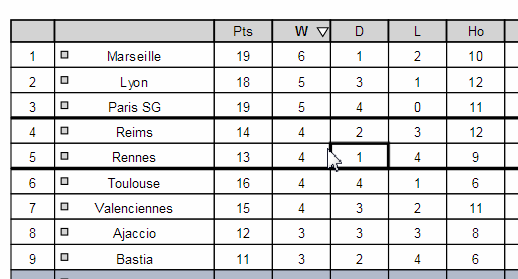
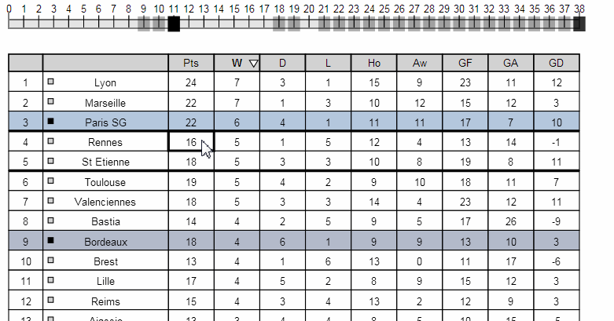

À Table!
======

This repository contains the code of the following article presented at [ACM CHI 2014](http://chi2014.acm.org):

Charles Perin, Romain Vuillemot, Jean-Daniel Fekete. [*À Table! Improving Temporal Navigation in Soccer Ranking Tables.*](http://hal.inria.fr/docs/00/92/98/44/PDF/atable.pdf) Proceedings of the 2014 Annual Conference on Human Factors in Computing Systems (CHI 2014), Apr 2014, Toronto, ON, Canada. ACM

An [online demo](http://charles.perin.free.fr/atable/) is also available. 

<table><tr><td></td><td></td></tr></table>

https://www.youtube.com/watch?v=a0duFWu3Zp0

Here is a summary of the project:

> À Table! is an enhanced soccer ranking table to improve temporal navigation, by combining two novel interaction techniques. Ranking tables order soccer teams as rows, and columns contain e. g., their points or number of scored goals. Because they are a snapshot of a championship at a time t, they are constantly updated with new results. Such updates change the rows vertical order, which makes the tracking of a team, over time, difficult. We observed that current tables on the web do not support such changes very well, are generally hard to read, and lack dynamic interactions. This contrasts with the extensive use of temporal trends by soccer analysts in articles. We introduce two interactive techniques to better explore time: DRAG-CELL is based on direct manipulation of values to browse ranks; VIZ-RANK uses a transient line chart of team ranks to visually explore a championship. An on-line evaluation with 143 participants shows that each technique efficiently supports a set of temporal tasks, not supported by current ranking tables, while not breaking the flow of users. This paves the way for efficiently introducing advanced visual exploration techniques to millions of soccer enthusiasts who use tables everyday, as well as other application domains which use ranking tables.

<iframe width="100%" height="400" src="http://www.youtube.com/embed/a0duFWu3Zp0?feature=oembed" frameborder="0" allowfullscreen></iframe>

To cite the project or the article:
<pre>
@inproceedings{perin2014table,
  title={{\`A} Table! Improving Temporal Navigation in Soccer Ranking Tables},
  author={Perin, Charles and Vuillemot, Romain and Fekete, Jean-Daniel and others},
  booktitle={Proceedings of the SIGCHI Conference on Human Factors in Computing Systems (CHI'14)},
  year={2014}
}
</pre>

We invite the research community to build new table navigation techniques upon this prototype. Its architecture is modular enough to quickly plug any new interaction technique.
